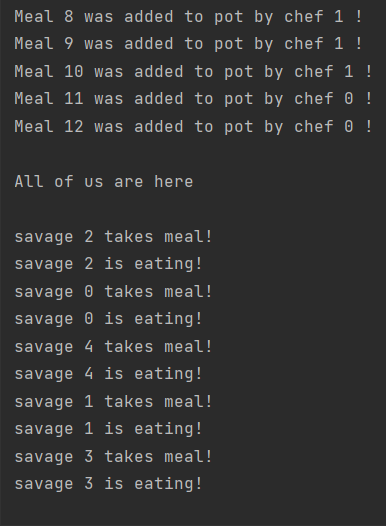
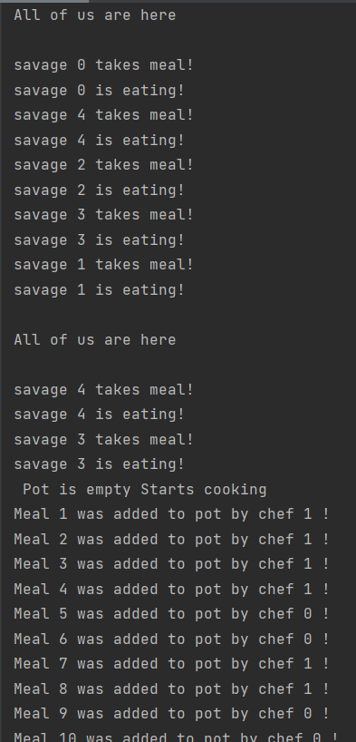

# Baranec_104419_feippds
Assignment 04: Impelement dining savages problem with synchronization

# Introduction
Savages in Equatorial Guinea are very social and advanced type of savages.
Not only do they always eat together every day, but they also have clever
chefs who prepare excellent zebra stew. However, they need 
reliable system in which they will announce all actions that are
by social feasting.

Savages always start eating together. The last savage to come, everyone
signals that everyone is here, and they can start feasting.
The savages take their portion from the pot one at a time until it is gone
pot empty.
Savage, who discovers that the pot is already empty, warns the cooks to
they boiled again.

The savages are waiting for the cooks to fill the full pot.
The cook always boils one portion and puts it in the pot.
When the pot is full, the savages continue feasting.
The whole process is repeated in an endless cycle.

# Solution

To synchronize all savages is used barrier. All savages are waiting at it, until the last one comes.
After that, they start to take their meals from pot. If there is no more meal, they wakes up cooks. 
They start to cook and refill the pot. When the pot is full, they take a break. 

Savages can continue eating. After all are done, they take next round of eating. 
Semaphores are used to secure integrity of the pot, only one person can grab from pot or put in the pot at the time.

# Implementation

Program represents tribe of  2 cooks (`NUM_COOKS`) and 5 savages (`NUM_SAVAGES`). They eat from pot of total capacity = 12 (`NUM_SERVINGS`). 
All these variables can be changed, up to out wish. For representing the 'together eating', is necessary to have capacity of pot bigger then total number of savages.
Our cooks are not counted as part of tribe, so they don't with all other savages.

Process of eating: Savages wait each other (at line 70), then they take their meal and eat (line 77), when they are all done (line 90), they start to eat again.
If pot is empty (line 76), they wake up cooks (line 82). Cooks start to cook after savages signal (line 82). They take turns on their wish and skills. 
When pot is full, they wait until the pot be empty again (line 102).

# Console output

