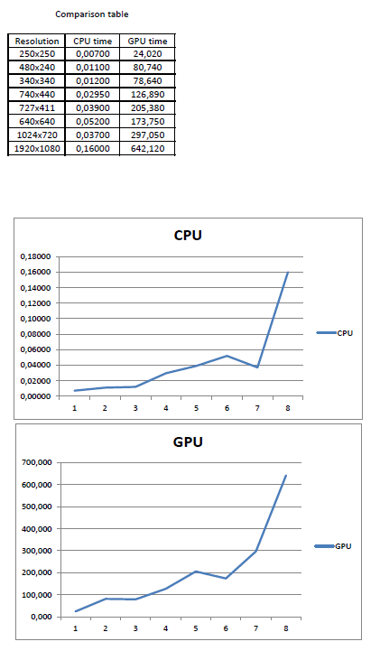

# Baranec_104419_feippds

Assignment 02: Implement dining philosophers problem

# Introduction 
This problem has many similar definitions. We use this one:

N - philosophers are sitting at a round table. (For this case we care about 5 philosophers).
Each philosopher has a plate in front of him. Each plate has a fork to the left and to the right of it. However, if any 2 philosophers sit next to each other, they share 1 fork as illustrated below, for 
philosopher 0 shares his right fork with philosopher 4.

Each philosopher behaves independently of other philosophers, but in accordance with the following scenario:
1. Think for some time.
2. Take the right fork.
3. Take the left fork.
4. Eat food.
5. Put the left fork back.
6. Put the right fork back.
Repeat the whole process again, i.e. go to step 1.

If a philosopher wants to take a fork, but this fork is currently used by the neighbor philosopher, 
the philosopher waits until the neighbor puts the fork back before getting it. If two neighbors try to take one fork at the same time, only one of them succeeds and the other one waits.

# Solution
We represent forks as Mutex. This fact allows us to avoid stealing forks between philosophers and allow them to strictly represent, that if they grab the fork they want to eat.
It also means that every fork can have only one owner at a time. This problem has more possible solutions, like using waiter, who tells how many philosophers can eat at once. I use this fact as comparison factor with, my representation. 

This solution use fact of that not all philosophers grab the left fork first. One of our philosophers (philosopher  1) prefers his left hand as dominant. That why he grabs first the left fork.

# Implementation

Philosophers sit behind the table, and they start their normal routine (line 54). This routine is simply defined as trying to eat and think in alternating order.
Firstly they think (line 55) when they are hungry, they grab forks. All right-handed  try to grab firstly right (line 68) and then left fork (line 70). Then they eat (line 62).
After the philosopher finish eating, he left forks at the table in the same order as they grab them (line 73 and 75) and continue thinking.

If there is philosopher 1 on the move (line 57), he to the same but starts with left fork (line 58).

# Conclusion
If we compare the main parts of programs `philosoph.py` and `philosopher.py`, and compare out prints, we can see, that if we consider problem 
of starving, then customer access is more effective and faster and philosophers have to make less effort to eat. But definitely all philosophers will eat in certain time.
That means they don't risk starving. 
